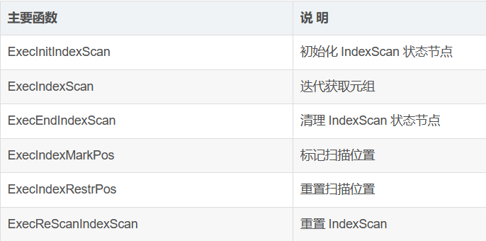
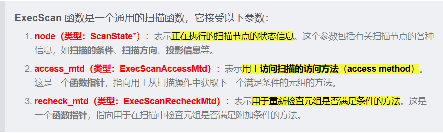

IndexScan 算子是索引扫描算子，对应 IndexScan 计划节点，相关的代码源文件是 “src/gausskernel/runtime/exector/nodeIndexScan.cpp”。如果过滤条件涉及索引，则查询计划对表的扫描使用 IndexScan 算子，利用索引加速元组获取。

### **ExecInitIndexScan 主函数**
ExecInitIndexScan 函数的作用是初始化 IndexScan 算子的状态信息，包括创建表达式上下文、初始化扫描键、打开基表和索引表，为执行 IndexScan 算子做好准备，提供必要的环境和数据结构。该函数主要用于执行索引扫描操作的初始化工作。

输入参数：

1. node : query planner提供的当前node的plan
1. estate: execution state
1. eflags: exector flag，通过和executor.h定义的flags进行位操作确定需要的执行器节点操作方法

输出：

IndexScanState:索引扫描的状态信息结构体

执行内容：

1. 创建状态结构，为节点创建表达式上下文
1. 初始化与运行时键对应的索引条件的子表达式 
1. 打开基表并在其上获取适当的锁，存储在 

index\_state->ss.ss\_currentRelation 中

1. 元组类型、投影信息、元组表初始化 
1. 打开索引关系，初始化索引特定的扫描状态 
1. 如果只需要执行解释计划（如 EXPLAIN 查询），则直接返回，不执行实际的查询。
1. 从索引限制条件构建索引扫描键，ORDER BY 表达式也必须以相同的方式转换为扫描键 
1. 调用ExecInitIndexRelation函数处理分区信息
1. 如果没有运行时键需要计算，就把扫描键传递给索引 AM(accessor method table)

Data structure:

indexScanState结构体实例 index\_state

下行接口：

在gausskernel/runtime/executor/execProcnode.cpp调用。

由ExexInitNodeByType函数调用，该函数会查看Plan\* node的type，如果是IndexScan类型就会调用，除此之外还有IndexOnlyScan、BitmapIndexScan等扫描方法。

ExexInitNodeByType由ExecInitNode调用，ExecInitNode会递归初始化all the nodes in the plan tree rooted at node

**ExecInitIndexRelation函数**

输入参数：

1\.node : query planner提供的当前node的plan

2\.estate: execution state

3\.eflags: exector flag，通过和executor.h定义的flags进行位操作确定需要的执行器节点操作方法

下行接口：

由ExecInitIndexScan调用，在以前版本没有这个函数，是对分区初始化操作的封装。

执行内容：

1. 调用TvChooseScanSnap(timecapsule version选择扫描快照)创建Snapshot scansnap
1. 调用 ExecInitPartitionForIndexScan为后续扫描初始化表分区列表和索引分区列表
1. 如果有partition table，初始化分区列表和索引分区列表，判断当前关系是否有subpartition
1. 验证一个DDL操作是否导致relation的其它tuple全部froze
1. 初始化scan descriptor

**ExecInitPartitionForIndexScan函数**

输入参数：

1. IndexScanState\* index\_state
1. estate

下行接口：

由ExecInitIndexRelation调用。获取index partition list和following indexscan的table partitions list

执行内容：

1. 获取indexscan计划和当前relation
1. 如果有pruningInfo，把partitionInfo信息写入到resultPlan
1. 遍历分区序列和分区号,把table partition添加到index\_state->ss.partitions列表，如果是subpartition，同样的方法添加到列表中

Data Structure:

IndexScan结构体实例plan

PruningResult结构体实例resultPlan

indexScanState结构体实例 index\_state

**ExecIndexScan主函数**

输入参数:PlanState结构体实例state，planstate是所有PlanState-type nodes的父类

输出:TupleTableSlot结构体

执行内容：

1. 直接将state强转成IndexScanState
1. 如果我们有运行时密钥，但它们还没有设置，那么现在就执行。
1. 如果是分区表，标记ss.ss\_ReScan为已经重新扫描，调用ExecReScan进行重扫描，如果不是就直接rescan
1. 调用ExecScan,找到IndexScan node的下一个tuple slot并返回

下行接口：

在ExecInitIndexScan函数里调用。它被初始化为

index\_state->ss.ps.ExecProcNode(函数指针function to return next tuple)

即告诉Scanstate.planstate如何获取下一个tuple

**IndexNext函数**

输入参数：IndexScanState结构体的node节点

输出：tupleTableSlot结构体

执行内容：

1. 如果indexorderdir方位是否backward（方向可以forward,backward,don’t care）,再检查estate->es\_direction，掉转它的方向
1. 如果是ustore存储引擎，获取下一个slot，同时检查是否出现脏读。如果不是ustore引擎,添加一个invalid参数的tuple
1. 更新indexScan描述符，因为哈希桶可能因为当前index进行替换。把扫描到的tuple存储起来。
1. 如果index损失了，通过获取的tuple查找index quals，如果失败了说明扫描结束，调用execClearTuple函数清理所有slot。

下行接口：

在ExecIndexScan函数里传给ExecScan函数作为ExecScanAccessMtd(scan access method)函数指针指向的函数。ExecScan函数里调用ExecScanFetch函数，将node传给IndexNext函数并返回下一个slot。

**IndexRecheck函数**

输入参数：

1. IndexScanState结构体实例node
1. TupleTableSlot\*slot

输出：bool值 tuple的所有indexqual条件是否都是true？

执行流程：

1. 将ss.ps.ps\_ExprContext导出为econtext，将slot插入econtext
1. Reset eontext,调用ExecQual函数判断所有indexqual条件是否都是true

下行接口：

由ExecIndexScan调用，传给ExecScan作为第三个参数函数指针，作为scan recheck方法

**ExecEndIndexScan主函数**

输入：IndexScanState结构体node节点

执行过程：

1. 从node提取relation和indexscan 描述符
1. 清理所有tuple table slot
1. 如果node是分区表，删除dummy relation。如果relation有子分区，释放partitionList。
1. 先释放index relation描述符，再释放relation

下行接口：

在execProcnode.cpp被ExecEndNodeByType函数调用。该函数会查看node的类型，有CStoreScanState,bitmapIndexScanState等，只有node是IndexScanState会这样释放node。

在nodeStub.cpp的ExecEndNodeStubScan被调用。还有在veccstorindexscan.cpp被调用，用来释放CStoreIndexScanState(列存储索引扫描)的b树扫描scanstate。

**ExecIndexMarkPos函数**

输入参数：IndexScanState结构体实例node

执行过程：只调用了一个函数scan\_handler\_idx\_markpos，把node的index scan state scandescriptor传入。

scan\_handler\_idx\_markpos会看indexRelation是不是包含bucket(检查是否有bucketoid)，如果是调用index\_markpos函数标记当前桶索引扫描位置，否则直接标记scan位置。

下行接口：

由execAmi.cpp(access method routines)的ExecMarkPos函数调用，当node是indexscanstate节点就使用该方法进行pos标记

**ExecIndexRestrPos函数**

输入参数：IndexScanState结构体实例node

执行过程：只调用了一个函数scan\_handler\_idx\_restpos，把node的index scan state scandescriptor传入。

scan\_handler\_idx\_restpos看indexRelation是不是包含bucket，如果是调用index\_markpos函数重置当前桶索引扫描位置，否则直接reset scan位置。

下行接口：

由execAmi.cpp(access method routines)的ExecRestrPos函数调用，当node是indexscanstate节点就使用该方法进行pos重置

**ExecReScanIndexScan主函数**

输入参数：IndexScanState结构体实例node

执行流程：

1. 对于递归流式重新扫描，如果 RuntimeKeys 的数量不为零，则直接返回而不重新扫描。
1. 如果我们正在进行运行时键计算（即，任何索引键值不是简单的常量），则计算新的键值。但是在计算新键值之前，先调用ResetExprContext宏重置上下文，以防每次扫描外部元组时内存泄漏。调用ExecIndexEvalRuntimeKeys函数更新scan keys。
1. 下面处理没有被剪枝分区表。如果 node->ss.ss\_ReScan = true，只需重新扫描非分区表；否则调用ExecInitNextPartitionForIndexScan切换到下一个分区进行扫描。

下行接口：

1\.在execAmi.cpp里ExecReScanByType函数调用，和前几个函数相同，识别到node是indexscanState时，采用该方法进行rescan。

2\.在vecExecutor（向量化执行查询计划）模块里，由处理列存储索引重扫描的函数ExecReScanCStoreIndexScan在rescan它的b树索引扫描state时调用

**ExecInitNextPartitionForIndexScan函数**

输入参数：IndexScanState结构体实例node

执行流程：

1. 获取分区序列，得到index relation id设为heapOid，找到对应的heapRelation
1. 如果heapRelation是子分区的，则获取子分区和子索引列表，构造一个带有下一个索引分区的虚拟关系。如果关系不是子分区的，则直接获取当前分区和当前索引分区。
1. ` `释放虚拟关系并更新当前索引分区。
1. 初始化扫描描述符，如果扫描描述符不为空，则重新扫描。

下行接口：

由ExecReScanIndexScan主函数调用

**ExecIndexEvalRuntimeKeys函数**

输入参数：

1. ExprContext结构体econtext,表达式上下文
1. IndexRuntimeKeyInfo结构体run\_time\_keys，runtimekey信息
1. num\_run\_time\_keys,有多少runtime keys

执行流程：

1. 将内存上下文切换为econtext->ecxt\_per\_tuple\_memory，旧上下文赋给old\_context
1. 对于每个运行时键，调用ExecEvalExpr(executor)提取运行时表达式并根据当前上下文进行评估,将结果放入适当的扫描键中。
1. 如果评估的结果是NULL，它将扫描键的参数设置为键值，并设置标志为NULL
1. 如果键值不为NULL，检查键值是否可能被压缩，如果是，强制解压键值
1. 切换回旧的内存上下文

下行接口：

由ExecReScanIndexScan函数当node的indexscanState有运行时键调用

Data Structure:

typedef struct {

`    `ScanKey scan\_key;    /\* 需要放入值的扫描键 \*/

`    `ExprState\* key\_expr; /\* 用于获取值的表达式 \*/

`    `bool key\_toastable;  /\* 表达式的结果是否为可Toast的数据类型？ \*/

} IndexRuntimeKeyInfo;

**ExecIndexEvalArrayKeys函数**

输入参数：

1. ExprContext结构体econtext,表达式上下文
1. IndexArrayKeyInfo结构体实例 array\_keys
1. num\_array\_keys,有多少array keys

输出：

如果有数组元素需要考虑，则返回TRUE；FALSE表示至少有一个空数组或者空值，所以不可能有匹配。在TRUE的结果下，扫描键会用数组的第一个元素进行初始化。

Data Structure:

typedef struct {

`    `ScanKey scan\_key;      /\* 需要放入值的扫描键 \*/

`    `ExprState\* array\_expr; /\* 用于获取数组值的表达式 \*/

`    `int next\_elem;         /\* 下一个要使用的数组元素 \*/

`    `int num\_elems;         /\* 当前数组值中的元素数量 \*/

`    `Datum\* elem\_values;    /\* num\_elems个Datum的数组 \*/

`    `bool\* elem\_nulls;      /\* num\_elems个是否为空的标志数组 \*/

} IndexArrayKeyInfo;

Datum就是uintptr\_t，一个可以存储指针的int

执行过程：

1. 调用ExecEvalExpr将array\_expr进行评估，如果结果为空则返回，ExecEvalExpr返回array\_datum。

1. 解构array\_datum，将array信息存储在elem\_values,elem\_nulls,num\_elems变量内
1. 如果elem\_nulls[0]为真（即，第一个元素为空）,将SK\_ISNULL标志添加到scan\_key->sk\_flags中，否则将SK\_ISNULL标志从scan\_key->sk\_flags中移除
1. 将array key的next\_elem设为1，在下一次迭代中，将处理数组的第二个元素。切换回旧上下文。

下行接口：

在nodeBitmapIndexScan.cpp由ExecReScanBitmapIndexScan函数调用。对node的biss\_arrayKeys进行评估(node是BitmapIndexScanState类型的)

**ExecIndexAdvanceArrayKeys函数**

输入参数：

1. IndexArrayKeyInfo结构体实例 array\_keys
1. num\_array\_keys,有多少array keys

输出： 前进到下一个数组键值集（如果有的话）。如果有另一组值需要考虑，则返回TRUE，否则返回FALSE。如果结果为TRUE，扫描键将用下一组值进行初始化。

执行过程：

1. 从右向左遍历数组键，如果下一个元素的索引超过了元素数量，重置下一个元素的索引为0

2\. 设置扫描键的参数(sk\_argument)为下一个元素的值。如果elem\_nulls[0]为真（即，第一个元素为空）,将SK\_ISNULL标志添加到scan\_key->sk\_flags中，否则将SK\_ISNULL标志从scan\_key->sk\_flags中移除

3\.arry\_key.next\_elem设为next\_elem+1

下行接口：

在nodeBitmapIndexScan.cpp由MultiExecBitmapIndexScan函数调用。对node的biss\_arrayKeys进行可前进检查。

**ExecIndexBuildScanKeys函数**

输入参数：函数是返回void，它会把传入的空数据进行赋值作为输出

` `输入参数是：

` `plan\_state: 我们正在为之工作的执行器状态节点

` `index: 我们正在为之构建扫描键的索引

` `quals: 索引条件（或indexorderbys）表达式

` `is\_order\_by: 如果处理ORDER BY表达式，则为true；如果处理条件，则为false

` `run\_time\_keys: 指向预先存在的IndexRuntimeKeyInfos的指针，如果没有则为NULL

` `num\_run\_time\_keys: 预先存在的运行时键的数量

` `输出参数是：

` `scan\_keys: 接收ScanKeys数组的指针

` `num\_scan\_keys: 接收扫描键的数量

` `run\_time\_keys: 接收IndexRuntimeKeyInfos数组的指针，如果没有则为NULL

` `num\_run\_time\_keys: 接收运行时键的数量

` `array\_keys: 接收IndexArrayKeyInfos数组的指针，如果没有则为NULL

` `num\_array\_keys: 接收数组键的数量

执行过程：

1. 为ScanKey结构体数组分配内存：每个qual一个
1. 遍历quals并赋给qual\_cell,从qual\_cell提取clause
1. 如果clause是一个opExpr:clause的leftop应该是一个index key，如果不是则报错。Varieble attribute number不能越过合理界
1. 从index得到opfamily，从opfamily得到op\_strategy( operator's strategy number)等opfamily属性。如果语句含order by，将信息写入未来初始化scankey的flags
1. 检查clause的rightop是否是RelabelType或者const(const被抽象为一个类)，如果不是则视为runtime key。然后调用ScanKeyEntryInitialize初始化scan key
1. 如果clause是row compare表达式，需要处理subsidiary(附属) scankey items，同时保证RowCompareExpr\* rc->opnos支持B树
1. 如果clause是 ScalarArray表达式，同样的处理方法。不过要检查index的rd\_am(relationdata for access method)是否支持ScalarArrayOpExpr quals？如果不支持需要延长array\_keys
1. clause还可以进行null test，如果不是以上的类型就报错为不支持的indexqual type
1. 没用到的array keys直接释放掉

下行接口：

在ExecInitIndexScan里负责给index\_state生成keys，也有在veccstoreindexscan,bitmapindexscan,indexonlyscan里被使用
